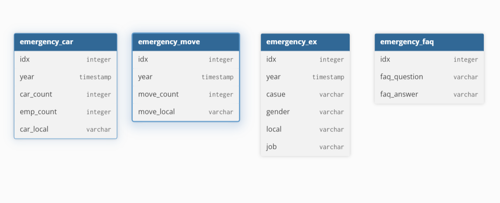

# 🚑 119 응급의료시스템 분석 대시보드

### 멤버 및 작업 사항 

| 이름   | 작업 사항            |  
|:-----:|:---------------:|
| 유성현 | 파일들을 모듈화하여 실행| 
| 강현욱 | csv 데이터를 DB에 insert | 
| 김준석 | DB data를 streamlit으로 표현| 
| 조남웅 | 웹 크롤링을 통해 DB에 data를 추가하고 streamlit으로 faq 표현| 
| 윤경은 | DB query 작업  | 

### ERD

### 프로젝트 기대효과
구급차와 응급 출동 현황으로 구급차가 부족한 지역을 시각적으로 파악하고자 함 

### 프로젝트 동작 순서

RUN.PY 실행 -> DB CLEAR -> DATA INSERT -> STREAMLIT VIEW

### 트러블슈팅
기존 활용하려던 csv 파일의 용량이 커서 필요한 Data 만 추출해서 사용,
프로그램 실행시 DB를 새로 받아오도록 하려고 하였으나 크롤링시 page를 새로고침하여 DB가 계속 빈 상태가 반복되는
경우가 생겨 프로그램 실행시 DB 클리어를 한번만 하도록 수정

### 4team 회고

| 이름   | 회고            |  
|:-----:|:---------------:|
| 유성현 | 팀원들의 파일을 모듈화 하여 실행하는데 폴더 및 파일들을 정리하는게 생각보다 쉽지 않음을 느꼈습니다.| 
| 강현욱 |         | 
| 김준석 |          | 
| 조남웅 |   | 
| 윤경은 |      | 

### 4team 발표자료 ppt

SKN21_1st_4team_PPT.pdf
